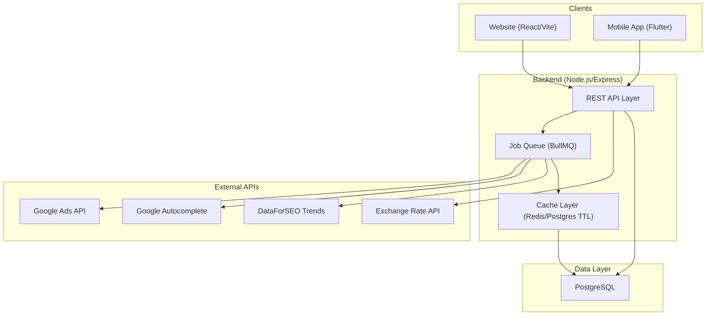

# YPYM Appraisal - Sistem Proyeksi & Kuantifikasi Nilai SEO

Sistem yang menerima 1 seed keyword dari user, lalu menghasilkan proyeksi nilai bisnis (USD & IDR) dari upaya SEO pada keyword tersebut beserta keyword turunannya. Output akhir: potensi leads, konversi, revenue, dan rekomendasi harga jasa SEO.

---

## User Review Required

> [!IMPORTANT]
> **Cross-Platform Strategy**: Saya sangat merekomendasikan **Flutter** untuk fase 2 & 3 (Android + iOS). Alasan:
> 1. **Single Codebase**: Flutter memungkinkan Anda membangun 1 project untuk Android + iOS sekaligus, mengurangi development time ~40-60%.
> 2. **Native Performance**: Tidak seperti React Native yang bridge ke native, Flutter compile ke native ARM code langsung.
> 3. **UI Consistency**: YPYM Design System (warna, font, spacing) bisa diimplementasikan identik di kedua platform.
> 4. **Web Support**: Flutter juga support build ke web, meskipun untuk website fase 1 saya tetap recommend React (Vite) karena SEO, performance, dan UX web lebih mature di React ecosystem.
>
> **Rekomendasi akhir**: **3 project, 1 backend**:
> | Fase | Folder | Stack | Alasan |
> |------|--------|-------|--------|
> | Fase 1 (Website) | `ypym-appraisal/` | React (Vite) + Vanilla CSS | SEO-friendly, fast, mature web ecosystem |
> | Fase 2+3 (Android+iOS) | `ypym-appraisal-app/` | Flutter (single project) | 1 codebase untuk 2 platform mobile |
> | Backend | `ypym-appraisal/backend/` | Node.js (Express) + PostgreSQL | Shared API untuk web & mobile |
>
> Jika Anda lebih prefer fully separate apps (React Native utk Android, Swift utk iOS), itu juga bisa. Tapi Flutter adalah pilihan paling efisien. **Mohon konfirmasi strategi ini.**

> [!WARNING]
> **API Keys Diperlukan Sebelum Development Dimulai**: Sistem ini membutuhkan beberapa API key:
> 1. **Google Ads API Developer Token** (Basic Access) - gratis tapi perlu apply
> 2. **DataForSEO API credentials** - untuk Google Trends data (~$0.00225/task)
> 3. **Exchange Rate API** (opsional, open.er-api.com gratis tanpa key)
>
> Apakah Anda sudah memiliki API key ini, atau kita mulai dengan mock data dulu?

---

## Open Questions

> [!IMPORTANT]
> 1. **Database**: Spec menyebutkan PostgreSQL. Apakah Anda sudah punya PostgreSQL instance (local/cloud)? Atau kita mulai dengan SQLite dulu dan migrasi ke Postgres nanti?
> 2. **Authentication**: Apakah sistem ini akan memiliki user registration/login, atau awalnya open-access tool?
> 3. **Deployment target website**: Apakah akan di-deploy di subdomain YPYM (misalnya `appraisal.ypym.app`)? Atau domain terpisah?
> 4. **Bahasa UI**: Apakah dual-language (EN + ID) dari awal, atau mulai dengan Bahasa Indonesia dulu?
> 5. **Hosting backend**: Coolify (sama seperti YPYM ecosystem lainnya)?

---

## Proposed Architecture

### System Overview



### Project Structure

```
ypym-appraisal/
├── backend/                          # Shared API backend
│   ├── src/
│   │   ├── server.ts                 # Express app entry
│   │   ├── config/
│   │   │   ├── database.ts           # DB connection config
│   │   │   └── env.ts                # Environment validation
│   │   ├── routes/
│   │   │   ├── project.routes.ts     # CRUD projects
│   │   │   ├── analysis.routes.ts    # Trigger & get analysis
│   │   │   ├── projection.routes.ts  # Re-run projections
│   │   │   └── health.routes.ts      # Health check
│   │   ├── services/
│   │   │   ├── autocomplete.service.ts
│   │   │   ├── google-ads.service.ts
│   │   │   ├── dataforseo.service.ts
│   │   │   ├── fx-rate.service.ts
│   │   │   ├── clustering.service.ts
│   │   │   ├── intent.service.ts
│   │   │   ├── difficulty.service.ts
│   │   │   ├── projection.service.ts
│   │   │   └── cost-ledger.service.ts
│   │   ├── models/
│   │   │   ├── project.model.ts
│   │   │   ├── keyword.model.ts
│   │   │   ├── trend.model.ts
│   │   │   └── cost-ledger.model.ts
│   │   ├── jobs/
│   │   │   └── pipeline.job.ts       # Full analysis pipeline
│   │   ├── middleware/
│   │   │   ├── auth.middleware.ts
│   │   │   ├── rate-limit.middleware.ts
│   │   │   └── error.middleware.ts
│   │   └── utils/
│   │       ├── retry.ts              # Exponential backoff
│   │       ├── stemmer.ts            # ID/EN stemming
│   │       └── validators.ts
│   ├── migrations/                   # Database migrations
│   ├── ../../ypym-company/package.json
│   ├── tsconfig.json
│   └── .env.example
│
├── frontend/                         # Website (Fase 1)
│   ├── index.html
│   ├── src/
│   │   ├── main.jsx
│   │   ├── App.jsx
│   │   ├── index.css                 # YPYM design tokens
│   │   ├── components/
│   │   │   ├── layout/
│   │   │   │   ├── Header.jsx        # YPYM-style header
│   │   │   │   ├── Footer.jsx        # YPYM-style footer
│   │   │   │   └── AppShell.jsx
│   │   │   ├── dashboard/
│   │   │   │   ├── ProjectSummary.jsx
│   │   │   │   ├── KeywordTable.jsx   # Virtualized table
│   │   │   │   ├── TrendChart.jsx     # 5-year trend overlay
│   │   │   │   ├── ProjectionCards.jsx # 1/12/24 month cards
│   │   │   │   ├── CostLedger.jsx
│   │   │   │   └── AssumptionPanel.jsx # Editable assumptions
│   │   │   ├── input/
│   │   │   │   ├── SeedKeywordForm.jsx
│   │   │   │   └── ParameterConfig.jsx
│   │   │   └── shared/
│   │   │       ├── StatusBadge.jsx
│   │   │       ├── CurrencyDisplay.jsx
│   │   │       └── LoadingStates.jsx
│   │   ├── hooks/
│   │   │   ├── useProject.js
│   │   │   └── useWebSocket.js       # Real-time pipeline progress
│   │   ├── pages/
│   │   │   ├── LandingPage.jsx
│   │   │   ├── NewProjectPage.jsx
│   │   │   ├── DashboardPage.jsx
│   │   │   └── ProjectListPage.jsx
│   │   └── utils/
│   │       ├── api.js
│   │       └── formatters.js
│   ├── public/
│   │   └── favicon.ico
│   ├── ../../ypym-company/package.json
│   └── vite.config.js
│
├── SKILL.md                          # Project skill file
├── PRODUCT_SPECS.md                  # Copy of seo_services_calc.md
├── .env.example
├── docker-compose.yml                # PostgreSQL + Redis
└── README.md
```

---

## Proposed Changes (Fase 1 - Website + Backend)

Kita akan build dalam tahapan iteratif sesuai spec bagian 9 (Rencana Build Bertahap).

---

### Component 1: Backend Foundation

#### [NEW] `backend/../../ypym-company/package.json`
Dependencies: `express`, `typescript`, `pg` (PostgreSQL driver), `bullmq` (job queue), `ioredis`, `cors`, `helmet`, `dotenv`, `zod` (validation), `axios` (HTTP client).

#### [NEW] `backend/src/server.ts`
Express server with:
- CORS configured for web (`localhost:5173`) and future mobile origins
- Rate limiting (100 req/min per IP)
- Health check endpoint
- Error handling middleware
- WebSocket support (via `ws`) for pipeline progress updates

#### [NEW] `backend/src/config/database.ts`
PostgreSQL connection pool using `pg`. Schema migrations via raw SQL files.

#### [NEW] `backend/src/config/env.ts`
Environment variable validation with Zod. Required: `DATABASE_URL`, `GOOGLE_ADS_*`, `DATAFORSEO_*`.

---

### Component 2: Database Schema & Models

#### [NEW] `backend/migrations/001_init.sql`
Tables:
- `projects` (id, seed_keyword, locale_country, locale_language, currency_base, currency_display, fx_rate, fx_rate_source, fx_rate_fetched_at, assumptions JSONB, status, created_at, updated_at)
- `keywords` (id, project_id FK, keyword, source, cluster_id, is_cluster_primary, avg_monthly_sv, sv_is_range_estimate, competition_index, intent, difficulty_score, capture_rate_effective, created_at)
- `trend_data` (id, project_id FK, monthly_index_5y JSONB, top_queries JSONB, rising_queries JSONB)
- `cost_ledger` (id, project_id FK, google_ads_api_cost, dataforseo_cost, total_cost_usd)
- `projections` (id, project_id FK, horizon_months, total_leads, total_conversions, revenue_usd, revenue_idr, recommended_service_fee, net_margin, assumptions_snapshot JSONB, calculated_at)
- `keyword_cache` (keyword_hash, data JSONB, fetched_at, ttl_days)

---

### Component 3: API Endpoints (REST)

#### [NEW] `backend/src/routes/project.routes.ts`

| Method | Endpoint | Description |
|--------|----------|-------------|
| `POST` | `/api/v1/projects` | Create project (seed keyword + params) |
| `GET` | `/api/v1/projects` | List all projects |
| `GET` | `/api/v1/projects/:id` | Get project detail + keywords + projections |
| `DELETE` | `/api/v1/projects/:id` | Delete project |

#### [NEW] `backend/src/routes/analysis.routes.ts`

| Method | Endpoint | Description |
|--------|----------|-------------|
| `POST` | `/api/v1/projects/:id/analyze` | Trigger full pipeline (queued job) |
| `GET` | `/api/v1/projects/:id/status` | Get pipeline progress |
| `GET` | `/api/v1/projects/:id/keywords` | Get keyword list with filters/sort |
| `GET` | `/api/v1/projects/:id/trends` | Get trend data |

#### [NEW] `backend/src/routes/projection.routes.ts`

| Method | Endpoint | Description |
|--------|----------|-------------|
| `POST` | `/api/v1/projects/:id/reproject` | Re-run projection with new assumptions (from cache) |
| `GET` | `/api/v1/projects/:id/projections` | Get all projection snapshots |
| `GET` | `/api/v1/projects/:id/export/:format` | Export (JSON/CSV/PDF) |

---

### Component 4: Pipeline Services (Backend Logic)

Setiap service mengimplementasi logic persis dari spec (bagian 4):

#### [NEW] `backend/src/services/autocomplete.service.ts`
- Google Autocomplete via unofficial endpoint
- Multi-permutasi: seed+a..z, seed+angka, "cara"+seed, "berapa"+seed, dll
- Delay 300-800ms antar request, rotasi user-agent
- Retry with backoff max 3x
- Fallback: skip jika blocked (jangan gagalkan pipeline)

#### [NEW] `backend/src/services/google-ads.service.ts`
- `KeywordPlanIdeaService.generateKeywordIdeas`
- Forecast bid tinggi ($99) untuk presisi SV
- Cache 30 hari per keyword
- Flag `sv_is_range_estimate` jika return rentang

#### [NEW] `backend/src/services/dataforseo.service.ts`
- Google Trends API wrapper via DataForSEO Standard Queue
- 5-year trend data
- top_queries + rising_queries → feed back ke Google Ads API untuk SV
- Cost tracking per task ($0.00225)

#### [NEW] `backend/src/services/clustering.service.ts`
- Tokenisasi + stemming ringan (ID + EN)
- Jaccard similarity >= 0.6 → same cluster
- Cluster primary = highest SV keyword
- `effective_sv_pool` = SV_primary + (SUM SV_others * overlap_discount_factor)
- Default overlap_discount_factor = 0.15 (user-editable)

#### [NEW] `backend/src/services/intent.service.ts`
- Dictionary-based classification (ID + EN word lists)
- 4 intents: transactional, commercial, informational, navigational
- Default fallback: commercial
- Conversion rate multiplier per intent

#### [NEW] `backend/src/services/difficulty.service.ts`
- `difficulty_score` = (competition_component * 0.5) + (word_count * 0.2) + (intent * 0.3)
- `capture_rate_effective` = target * (1 - difficulty/100 * 0.6)

#### [NEW] `backend/src/services/projection.service.ts`
- S-curve ramp-up: `capture_at_month(m) = effective / (1 + e^(-0.8 * (m - ramp/2)))`
- Per-keyword monthly summation (not flat multiplication)
- 3 horizons: 1, 12, 24 months
- Dual currency output (USD + IDR)

#### [NEW] `backend/src/services/fx-rate.service.ts`
- Fetch from open.er-api.com (gratis, tanpa key)
- Cache rate per session/project
- Store timestamp di `fx_rate_fetched_at`

#### [NEW] `backend/src/services/cost-ledger.service.ts`
- Track Google Ads API request count (gratis tapi monitor kuota)
- Track DataForSEO cost per task
- Calculate net margin

---

### Component 5: Job Queue & Pipeline Orchestration

#### [NEW] `backend/src/jobs/pipeline.job.ts`
Full pipeline orchestration:
```
Step 1: Autocomplete Expansion → raw_keyword_ideas[]
Step 2: Google Ads API Enrichment → keyword_ideas[] with SV, competition, CPC
Step 3: DataForSEO Trends → trend data + new keyword ideas
Step 4: Feed new keywords from Trends back to Step 2
Step 5: Deduplication & Clustering
Step 6: Intent Classification
Step 7: Difficulty Weighting
Step 8: Projection Calculation (1/12/24 months)
Step 9: Cost Ledger update
Step 10: Save all results to DB
```
Each step emits WebSocket progress updates.

---

### Component 6: Frontend Website (React/Vite)

#### [NEW] `frontend/` - Full Vite + React setup

**Design System Implementation** (mengikuti YPYM Design System):
- Colors: `#1A4BFF` (primary blue), `#0B0F41` (deep navy), `#FBFBFB` (bg), `#DAFF01` (accent lime), `#30FFFC` (accent cyan)
- Typography: Google Sans Flex (headings/UI), Maven Pro (body), JetBrains Mono (notes/code)
- Buttons: `.btn-solid`, `.btn-ghost`, `.btn-light` (height 35px)
- No em-dash, no italic, underline rules per spec

**Pages**:
1. **Landing Page** - Hero section + brief tool description + CTA "Start Analysis"
2. **New Project Page** - Seed keyword input form + parameter configuration (locale, currency, assumptions)
3. **Dashboard Page** - Full results dashboard with:
   - Summary cards (total keywords raw/clustered, effective SV pool)
   - Virtualized keyword table (sortable, filterable)
   - 5-year trend chart with rising query overlay
   - Projection comparison cards (1/12/24 months) with USD & IDR columns
   - Cost ledger & margin estimate
   - Editable assumptions panel + "Re-run Projection" button
   - Export buttons (JSON, CSV, PDF)
4. **Project List Page** - History of past analyses

**Header**: Simplified YPYM-style header with "YPYM" logo linking to ypym.app, product name "Appraisal", and minimal nav.
**Footer**: YPYM ecosystem footer with links to main products and legal disclaimer.

---

### Component 7: Infrastructure

#### [NEW] `docker-compose.yml`
- PostgreSQL 16 container (port 5432)
- Redis 7 container (port 6379) - for BullMQ job queue
- Volume mounts for data persistence

#### [NEW] `.env.example`
All required environment variables documented.

---

## Verification Plan

### Automated Tests
```bash
# Backend unit tests
cd backend && npm test

# API integration tests
cd backend && npm run test:integration

# Frontend build verification
cd frontend && npm run build
```

### Manual Verification
1. **Pipeline Test**: Submit seed keyword "jasa seo" dan verifikasi:
   - Autocomplete menghasilkan keyword ideas
   - Google Ads API mengembalikan SV data
   - Clustering menghasilkan clusters yang masuk akal
   - Intent classification akurat untuk kata kunci Indonesia
   - Projection numbers logis (tidak menjumlahkan raw SV tanpa dedup)
2. **UI Test**: Verifikasi semua dashboard widgets render correctly
3. **Dual Currency**: Pastikan USD dan IDR tampil berdampingan
4. **Re-run**: Ubah assumptions dan verifikasi projection berubah tanpa re-fetch data
5. **Mobile-ready API**: Test endpoints dengan curl/Postman untuk memastikan response format konsisten
6. **YPYM Design Compliance**: Verifikasi font, color, button, dan spacing sesuai design system

### Development Build Phase Plan

| Phase | Focus | Deliverable |
|-------|-------|-------------|
| Phase 1A | Backend foundation + DB | Working API server with PostgreSQL, migrations, basic CRUD |
| Phase 1B | Pipeline services (mock data) | All 8 pipeline steps working with mock/cached data |
| Phase 1C | Real API integration | Connect Google Ads, DataForSEO, Autocomplete |
| Phase 1D | Frontend landing + input | Landing page, new project form, parameter config |
| Phase 1E | Frontend dashboard | Full dashboard with all widgets |
| Phase 1F | Polish + hardening | Error handling, rate limiting, export, caching |
