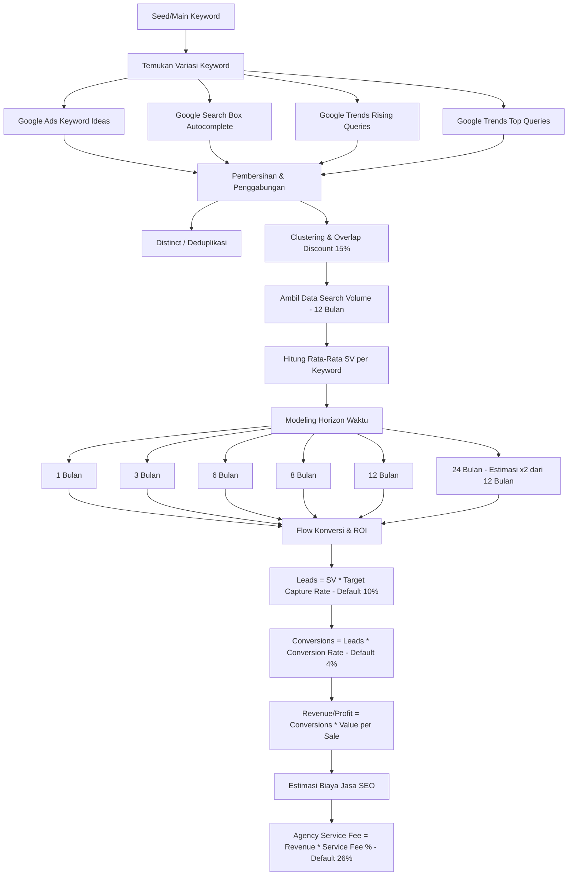

# YPYM Appraisal - SEO Pricing & Projection Logic Story

Dokumen ini mendokumentasikan alur logika (*logic story*) dan formula perhitungan harga jasa SEO berbasis data riil yang Anda sampaikan, dibandingkan dengan implementasi sistem saat ini.

---

## 1. Alur Logika Perhitungan (Logic Story)

Berikut adalah visualisasi alur data dan formula konversi YPYM Appraisal dari input kata kunci hingga nilai investasi SEO:

---

## 2. Pemetaan Formula Perhitungan

| Langkah Logika | Detail / Formula Anda | Status Implementasi Saat Ini |
| :--- | :--- | :--- |
| **1. Pengumpulan Variasi** | Google Ads, Google Autocomplete, Google Trends (Top & Rising). | **Sudah Sesuai** (Mengambil data secara real-time dari API DataForSEO & Google). |
| **2. Deduplikasi & Overlap** | Menghapus overlapping keyword potensial. | **Sudah Sesuai** (K-Means Clustering memilih keyword utama, variasi lainnya didiskon dengan *Overlap Discount* default `0.15`). |
| **3. Durasi Search Volume** | Mengambil rata-rata bulanan historis 12 bulan terakhir. | **Sudah Sesuai** (Data volume bersumber dari rata-rata bulanan DataForSEO). |
| **4. Rata-Rata SV per Keyword** | `Total SV Gabungan / Qty Keyword` | **Tersedia di Data** (Belum ditonjolkan secara visual sebagai card/metrik utama, bisa kita tambahkan). |
| **5. Horizon Waktu Proyeksian** | **1, 3, 6, 8, 12, dan 24 bulan**. | **Perlu Penyesuaian** (Sistem saat ini hanya memproyeksikan **1, 12, dan 24 bulan**). |
| **6. Flow Konversi & ROI** | `Leads = Traffic (SV * Capture Rate 10%)` `Conversions = Leads * Conversion Rate 4%` `Revenue = Conversions * Value per Sale` | **Sudah Sesuai** (Menggunakan formula konversi bertahap dengan parameter asumsi dari input panel melayang). |
| **7. Nilai Jasa SEO (Agency)** | `Revenue * Service Fee %` (Range: 15-40%, Default: **26%**). | **Perlu Penyesuaian** (Sistem saat ini menggunakan default **20%**, perlu kita naikkan ke **26%**). |

---

## 3. Rencana Aksi Penyesuaian (Jika Anda Menyetujui)

Jika alur logika di atas sudah sesuai dengan visi Anda, kami merekomendasikan penyesuaian kode berikut:

1. **Ubah Target Horizon Proyeksi**:
   Menambahkan horizon **3, 6, dan 8 bulan** pada visualisasi tabel proyeksi di halaman dashboard (sehingga total ada 6 horizon: 1m, 3m, 6m, 8m, 12m, 24m).
2. **Update Nilai Default Parameter**:
   * Mengubah default `serviceFeePct` dari **20%** menjadi **26%** di form pembuatan proyek baru dan panel melayang dashboard.
3. **Tambahkan Metrik Rata-Rata SV**:
   * Menampilkan metrik rata-rata Search Volume per keyword di halaman dashboard untuk memberikan wawasan tambahan.

---

> [!NOTE]
> Kami **belum melakukan modifikasi kode apa pun** sesuai dengan permintaan Anda. Silakan tinjau alur logika ini terlebih dahulu. Beritahu kami jika Anda ingin kami mengeksekusi rencana penyesuaian di atas!
